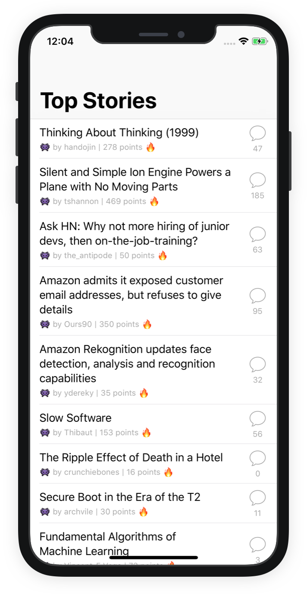
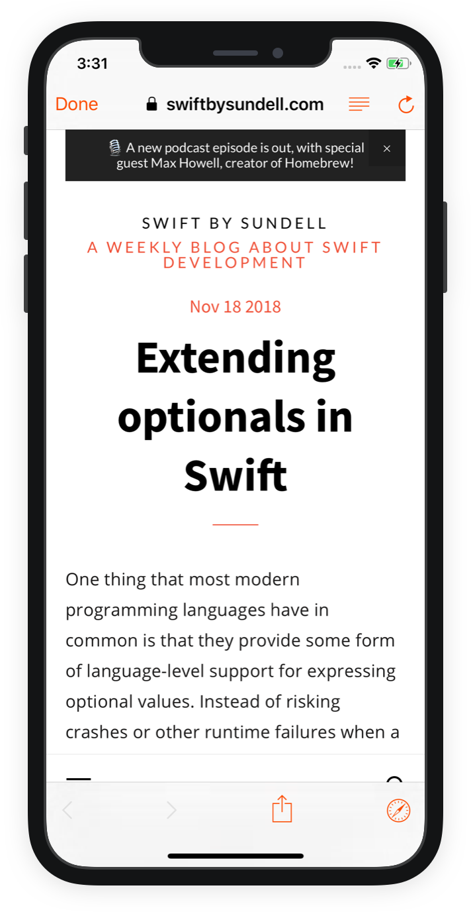

Hackr: a simple iOS client for Y Combinator's [Hacker News](https://news.ycombinator.com/).

|         | Features  |
----------|-----------------
:trophy: | See Hacker News' top stories
:eyeglasses: | Accessibility for the visually impaired
:octocat: | Free and open source

## Future Work

- **User Login**: Let users log in to their HN account.
- **Comments and Upvotes**: After users are able to log in, let them add comments and upvotes on HN stories.
-  **Best Stories**: Add a best stories view.
- **New Stories**: Add a new stories view.
