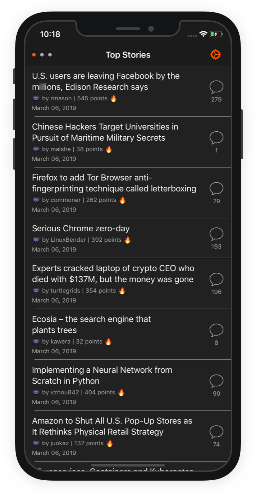
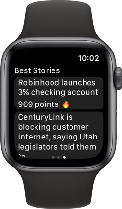

Hackr: a simple iOS client for Y Combinator's [Hacker News](https://news.ycombinator.com/).

|         | Features  |
----------|-----------------
:trophy: | See Hacker News' top, new, and best stories
:watch: | Apple Watch app for top 5 stories in each category
:eyeglasses: | Accessibility for the visually impaired
:octocat: | Free and open source

## Future Work

- **User Login**: Let users log in to their HN account.
- **Comments and Upvotes**: After users are able to log in, let them add comments and upvotes on HN stories.
- **Hackr Watch**: Add Apple Watch Hackr integration.
-  ~~**Best Stories**: Add a best stories view.~~
- ~~**New Stories**: Add a new stories view.~~
